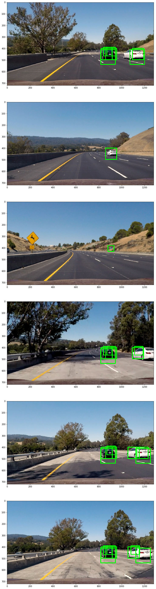

# Vehicle Detection Project

The goals / steps of this project are the following:

* Perform a Histogram of Oriented Gradients (HOG) feature extraction on a labeled training set of images and train a classifier Linear SVM classifier
* Optionally, you can also apply a color transform and append binned color features, as well as histograms of color, to your HOG feature vector.
* Note: for those first two steps don't forget to normalize your features and randomize a selection for training and testing.
* Implement a sliding-window technique and use your trained classifier to search for vehicles in images.
* Run your pipeline on a video stream (start with the test_video.mp4 and later implement on full project_video.mp4) and create a heat map of recurring detections frame by frame to reject outliers and follow detected vehicles.
* Estimate a bounding box for vehicles detected.

[//]: # (Image References)
[image1]: ./examples/car_not_car.png
[image2]: ./examples/HOG_example.jpg
[image3]: ./examples/sliding_windows.jpg
[image4]: ./examples/sliding_window.jpg
[image5]: ./examples/bboxes_and_heat.png
[image6]: ./examples/labels_map.png
[image7]: ./examples/output_bboxes.png
[video1]: ./project_video.mp4
[image_hog_vis]: ./output_images/hog_vis.png
[image_sliding_window]: ./output_images/multi_scale_sliding_window.png
[image_detection_pipeline1]: ./output_images/detecion.png
[image_detection]: ./output_images/test_detection_images.png
[image_heatmap]: ./output_images/heatmap.png
## [Rubric](https://review.udacity.com/#!/rubrics/513/view) Points
#### Here I will consider the rubric points individually and describe how I addressed each point in my implementation.  

---

#### 1. Provide a Writeup / README that includes all the rubric points and how you addressed each one.  You can submit your writeup as markdown or pdf.  [Here](https://github.com/udacity/CarND-Vehicle-Detection/blob/master/writeup_template.md) is a template writeup for this project you can use as a guide and a starting point.  

You're reading it!

### Histogram of Oriented Gradients (HOG)

#### 1. Explain how (and identify where in your code) you extracted HOG features from the training images.

The code for this step is contained in the `def get_hog_features` of the IPython notebook `train_classifier.ipynb`

Here is an example of a vehicle from the KITTI dataset.

![alt text][image_hog_vis]

#### 2. Explain how you settled on your final choice of HOG parameters.

I tried various combinations of parameters such as color space, number of orientation, cell per block. The selection is based on the test accuracy of SVM that I build. And finally I decide to use the following parameters of HOG feature detector

|parameter        | value         |
| -------------   |:-------------:|
|Color_space      | 'YCrCb'       |
|HOG orientations | 9             |
|Pixel per cell   | 8             |
|Cell per block   | 2             |
|Hog_channel      | ALL           |

#### 3. Describe how (and identify where in your code) you trained a classifier using your selected HOG features (and color features if you used them).

The code for training the classifier is in the IPython notebook `train_classifier.ipynb`. I randomly pick 4000 positive and negative training data from the entire training set (8000). I trained a linear SVM classifier based on a combination of different features. These include histogram of color, spatial features and HOG features. The parameter are specified as following:

|parameter        | value         |
| -------------   |:-------------:|
|spacial size | (16, 16) |
|Nr. of histogram bins| 32|

The  individual features are stacked into a 1-D array and I apply [`StandardScaler`](http://scikit-learn.org/stable/modules/generated/sklearn.preprocessing.StandardScaler.html) to normalize the features. The final classifier has a validation accuracy of 99.12%.
### Sliding Window Search

#### 1. Describe how (and identify where in your code) you implemented a sliding window search.  How did you decide what scales to search and how much to overlap windows?

I decided to search windows with different scales. I specified the maximal and minimal window size as well as the position of them. Then I interpolate the position and the scale between the maximal and minimal windows. The code for generating the windows is implemented in function `def multi_scale_sliding_window(img, nr_interpolation)`.

![alt text][image_sliding_window]

####2. Show some examples of test images to demonstrate how your pipeline is working.  What did you do to optimize the performance of your classifier?

Ultimately I searched on 7 scales using YCrCb 3-channel HOG features plus spatially binned color and histograms of color in the feature vector, which provided a nice result.  Here are some example images:

---

### Video Implementation

#### 1. Provide a link to your final video output.  Your pipeline should perform reasonably well on the entire project video (somewhat wobbly or unstable bounding boxes are ok as long as you are identifying the vehicles most of the time with minimal false positives.)
Here's a [link to my video result](https://youtu.be/nKs8mbIa6dI)

#### 2. Describe how (and identify where in your code) you implemented some kind of filter for false positives and some method for combining overlapping bounding boxes.

The filtering is done with the class `class Detector()`. I use a queue to update positive detections for the last 10 frames.  From the positive detections I created a heatmap and then thresholded that map to identify vehicle positions. I then used `scipy.ndimage.measurements.label()` to identify individual blobs in the heatmap.  I then assumed each blob corresponded to a vehicle.  I constructed bounding boxes to cover the area of each blob detected.  

Here's an example result showing the heatmap from a series of frames of video, the result of `scipy.ndimage.measurements.label()` and the bounding boxes then overlaid on the last frame of video:

### Here are six frames and their corresponding heatmaps:
![alt text][image_heatmap]

---

### Discussion

#### 1. Briefly discuss any problems / issues you faced in your implementation of this project.  Where will your pipeline likely fail?  What could you do to make it more robust?

I spend much effort to tune the search range of sliding window. Too many windows results in the increase the processing time while too little windows will decrease the rate of true positives. Besides, I find that it is important to train a good SVM classifier. If the classifer does a great job, the number of sliding windows can be reduced. For this reason, I also make large effort to train a better classifer. Most work are done with the choice of feature parameters. The generation of the video still takes quite a long time (30 min) to produce the current result. It is not yet able to detect vehicle on the fly. There is still space to improve  current implementation by e.g. improve the performance of classifier as well as reduce the number of windows.
